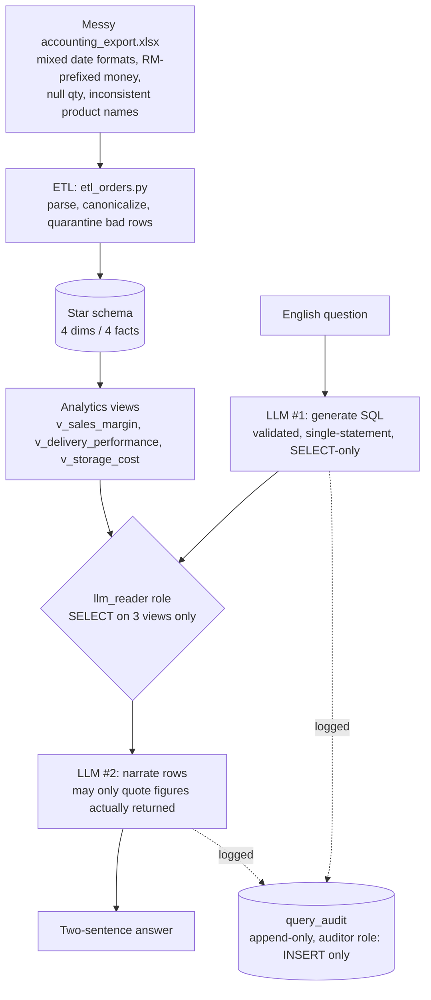

# Introduction

`coldchain-ops` is a synthetic fresh-fruit cold-chain distribution platform, built end to end as a portfolio piece: a messy accounting-system Excel export gets modeled, cleaned, loaded into a proper star schema, and then handed to an LLM — but only through a governed, read-only, tool-scoped door, because in a real deployment you don't hand a model your database key.

## Why This Exists

Most "LLM + database" portfolio projects stop at the demo: paste a schema into a frontier model, let it write SQL, ship a chatbot. That's the easy 80% — any current frontier model can already do it, so it's not what makes an engineer worth hiring.

This project is about the other 20%: what it actually takes to let a language model touch a real business's data without that being a liability. Concretely, that means a dedicated Postgres role (`llm_reader`) that can only `SELECT` from three read-only analytics views and nothing else — so the safety mechanism is a database privilege, not a prompt asking the model to behave. It means an append-only audit log of every question asked, every SQL statement generated, and every error, written by a role that can `INSERT` and nothing else. It means an eval harness that catches regressions automatically instead of "it looked right when I read it." And it means being honest that this doesn't remove the model's core failure mode — a wrong answer that looks exactly like a right one, where every safety layer in the system behaves exactly as designed and the program still confidently states the wrong answer.

Every apparent limitation in this system — read-only access, a small scoped role, a narrator forbidden from computing its own numbers — is a decision, not a shortcoming.

## Architecture



## What's Demonstrated, Phase by Phase

| Phase | What it proves |
|---|---|
| 0 — Skeleton | Postgres (`pgvector/pg17`) via Docker Compose, `uv` project setup |
| 1 — Star schema | 4 dimensions / 4 facts, FK-enforced load order, goose migrations |
| 2 — Synthetic data generator | Deterministic dimension seeding + a deliberately messy accounting export (mixed date formats, `RM`-prefixed money, ~3% null quantities, casing/spacing product-name variants) |
| 3 — ETL | Parses the mess, quarantines what can't be trusted (374 of 12,491 rows), preserves the export's real order IDs via `OVERRIDING SYSTEM VALUE`, loads facts idempotently |
| 4 — Analytics views | `v_sales_margin`, `v_delivery_performance`, `v_storage_cost` — the only surface the LLM layer is ever allowed to see |
| 5 — Semantic search | pgvector + `sentence-transformers` embeddings over products; querying "citrus fruit" correctly ranks oranges top with zero lexical overlap |
| 6 — Governed NL→SQL | English question → validated read-only SQL → narrated answer, role-scoped, audited, evaluated |

<File>PROGRESS.md</File> in the repo is the full running log (row counts, verification steps, decisions) behind every line in that table.

## The Demo

A basic question, answered correctly regardless of backend:

```
➤ uv run python src/ask_question.py "which region has the worst delivery breach rate?"

SQL: SELECT region, breach_rate FROM v_delivery_performance ORDER BY breach_rate DESC LIMIT 1;

South has the worst delivery breach rate at 12.4%, more than three times North's 4.0%.
```

A harder question — asking for a count *and* the underlying names in one query — is where the two backends diverge. This is the clearest demonstration in the project of why the model choice behind the SQL-generation step matters, and why that step is kept narrowly scoped and audited rather than trusted outright.

`LLM_BACKEND=ollama` (`qwen2.5-coder:7b`, running locally) drops the `DISTINCT`, turning a 2-row answer into one row per matching order line:

```
➤ LLM_BACKEND=ollama uv run python src/ask_question.py "how many different kinds of orange products we have and what are the names of the product?"

SQL: SELECT count(*) AS num_orange_products, string_agg(product_name, ', ') AS orange_product_names FROM v_sales_margin WHERE product_name ILIKE '%orange%' AND category = 'Citrus'

Valencia Orange

['num_orange_products', 'orange_product_names']
(2928, 'Navel Orange, Navel Orange, Navel Orange, ... [truncated — repeats for ~2928 rows, alternating blocks of Navel Orange and Valencia Orange]
```

`LLM_BACKEND=gemini` (`gemini-2.5-flash-lite`, the deployed default) gets the same question right:

```
➤ LLM_BACKEND=gemini uv run python src/ask_question.py "how many different kinds of orange products we have and what are the names of the product?"

SQL: SELECT COUNT(DISTINCT product_name) AS distinct_orange_products_count, STRING_AGG(DISTINCT product_name, ', ') AS orange_product_names FROM v_sales_margin WHERE category = 'Citrus';

We have 2 different kinds of orange products: Navel Orange, Valencia Orange.

['distinct_orange_products_count', 'orange_product_names']
(2, 'Navel Orange, Valencia Orange')
```

Every one of these runs — right or wrong — is written to `query_audit`. But that's a narrower guarantee than it sounds like, which is worth looking at directly.

### The Audit Trail's Blind Spot

```
coldchain=# \x auto
coldchain=# SELECT * FROM v_query_audit ORDER BY asked_local DESC LIMIT 2;
-[ RECORD 1 ]-------------------------------------------------------------------------------------------
asked_local | 2026-07-15 19:45:17.037642
model       | gemini-2.5-flash-lite
question    | how many different kinds of orange products we have and what are the names of the product?
sql_preview | SELECT COUNT(DISTINCT product_name) AS distinct_orange_products_count, STRING_AG
failed      | f
-[ RECORD 2 ]-------------------------------------------------------------------------------------------
asked_local | 2026-07-15 19:43:55.093827
model       | qwen2.5-coder:7b
question    | how many different kinds of orange products we have and what are the names of the product?
sql_preview | SELECT count(*) AS num_orange_products, string_agg(product_name, ', ') AS orange
failed      | f
```

Both rows say `failed = f`. `v_query_audit.failed` is defined as `error IS NOT NULL` — it flips to true only when something threw: a DB error, an LLM timeout, a `validate_sql` rejection. The Ollama run above isn't any of those. It's a syntactically valid, successfully executed `SELECT` that happens to answer a different question than the one asked (every matching *order line* instead of every distinct *product*). Nothing in the pipeline throws on that, so nothing marks it.

That's the honest limit of this audit trail: it catches the system breaking, not the system being wrong while working exactly as designed. Run once and read by a human, the bug is obvious. Run a thousand times unattended, it's a `failed = f` row indistinguishable from every correct one — the kind of gap that would need something outcome-aware (an eval-style correctness check, not an error check) to close, and the project's eval pipeline in its current form checks known fixed cases, not open-ended production traffic. Worth stating plainly rather than implying the audit log is a complete safety net.

### A Bug Neither Backend Avoids

Not every failure is model-specific. Ask for two numbers that come from different tables at different grains — total margin (`v_sales_margin`, one row per order line) and total storage cost (`v_storage_cost`, one row per product per day) — grouped by category:

```
➤ uv run python src/ask_question.py "What is the total margin and total storage cost for each product category?"

-- qwen2.5-coder:7b --
SQL: SELECT sm.category, SUM(sm.margin) AS total_margin, SUM(sc.daily_cost) AS total_storage_cost
     FROM v_sales_margin sm JOIN v_storage_cost sc ON sm.product_name = sc.product_name
     GROUP BY sm.category

('Citrus', 666614941.42, 101623315.2000)
('Pome',   824571421.94,  89264412.0000)
...

-- gemini-2.5-flash-lite --
SQL: SELECT sc.category, COALESCE(SUM(sm.margin), 0) AS total_margin, COALESCE(SUM(sc.daily_cost), 0) AS total_storage_cost
     FROM v_sales_margin sm FULL OUTER JOIN v_storage_cost sc
       ON sm.product_name = sc.product_name AND sm.category = sc.category
     GROUP BY sc.category

('Citrus', 666614941.42, 101623315.2000)
('Pome',   824571421.94,  89264412.0000)
...
```

Both backends join the two views directly on product/category. Since neither view is unique per product, the join pairs every matching order-line row with every matching storage-day row instead of lining the two lists up 1:1 — a category with 2,928 sales rows and 1,039 storage rows doesn't produce 2,928 + 1,039 combined rows, it produces up to 2,928 × 1,039. Every real margin figure then gets summed once per storage row it happened to pair with, and vice versa. The true numbers, computed independently with two single-view `SUM ... GROUP BY` queries and no join at all:

| category | true total margin | true total storage cost |
|---|---|---|
| Berries | 985,481.14 | 55,274.00 |
| Citrus | 1,282,461.69 | 69,404.80 |
| Pome | 1,684,904.90 | 59,211.00 |
| Tropical | 2,079,089.86 | 114,447.60 |

Both backends were off by roughly 500-1500x, identically. Two things make this different from the `DISTINCT` bug above: the correct answer *is* reachable within the pipeline's existing constraints (a single `SELECT` that pre-aggregates each view in a subquery before joining passes `validate_sql` and returns the exact numbers above), and the information needed to avoid the mistake is already in the prompt — the view schema documents each view's grain inline (`-- one row per order line` / `-- one row per product per day held in storage`). Both models had that information available and neither used it.

That leaves two honest ways to close this gap, and this project deliberately stops here rather than picking one by default: (1) keep the same backend and iterate on the prompt until it reliably makes the model act on the grain information it's already given, or (2) accept that as an open-ended, no-fixed-endpoint effort not worth chasing, and treat "upgrade to a more capable backend" as the fix instead — plausible given the correct query is well within reach of a more careful model, but unverified here, since this pipeline only wires up Gemini and a local Ollama model. Recording the trade-off honestly seemed more valuable than picking a side and prompt-engineering until this one case happened to pass.

## Key Engineering Decisions

- **Role-scoped access, not prompt-level trust.** `llm_reader` can `SELECT` from three views and nothing else at the database layer — no amount of prompt injection changes what the role is physically permitted to run.
- **Quarantine over silent-drop.** Rows that fail ETL validation (bad quantities, unparseable dates) go to a rejects CSV instead of vanishing — the pipeline's data-quality decisions are auditable, not hidden.
- **The export's real IDs are preserved**, not regenerated, using `OVERRIDING SYSTEM VALUE` — so loaded orders stay traceable back to the original messy source file.
- **An eval harness caught a real bug**: Gemini was still sampling at nonzero temperature and "percentage" was ambiguous (fraction vs. ×100) in the prompt. Both were invisible from reading the code and only surfaced once answers were checked against known-correct values across repeated runs.
- **The narrator is shown the executed SQL**, not just the result rows, so it can say "no rows matched this filter" honestly instead of asserting nothing exists — the difference between a dangerous wrong answer and a system that flags its own uncertainty.

## Stack

Postgres 17 + pgvector · goose (migrations) · pandas · SQLAlchemy / psycopg3 · sentence-transformers · Gemini (`gemini-2.5-flash-lite`, default) with a swappable local Ollama backend (`qwen2.5-coder:7b`) behind the same interface · `uv` for dependency management.
